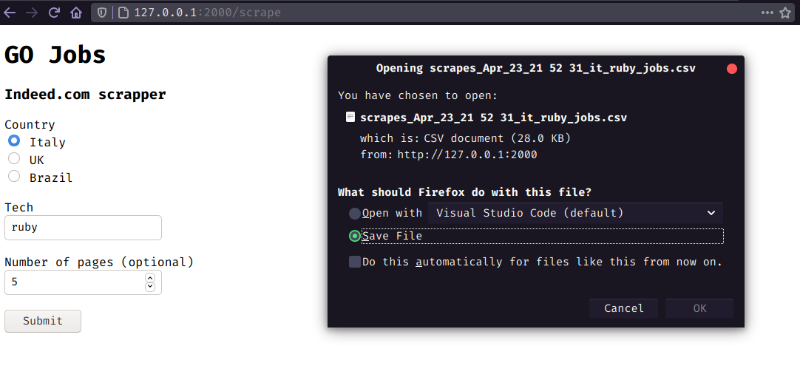

# Nomad Coders - GO for beginners

<p align="center">
    
</p>

## Table of Contents

- [About](#about)
- [Getting Started](#getting_started)
- [Usage](#usage)
- [Libs](#libs)
- [Docs](#docs)
- [Resources](#resources)

## About <a name = "about"></a>

A simple web app that scrapes Indeed.com job listings
and saves them to downloadable `.csv` files.

- [Take the course too!](https://nomadcoders.co/go-for-beginners/lobby)
- [Certificate of Completion](https://nomadcoders.co/certs/1c9ad49b-75bf-4fdf-abca-45d10d7aebca)

## Getting Started <a name = "getting_started"></a>

### Prerequisites

Install the latest version of `Go` in your machine.

### Installing

Clone the repo, start the server and open http://localhost:2000 in your browser

```bash
$ git clone https://github.com/librity/nc_gojobs
$ cd nc_gojobs
$ go run main.go
```

Automagically analyze race conditions during compilation:

```bash
$ go build -race
```

## Usage <a name = "usage"></a>

Choose a country and the tech you wanna work with, then hit submit.
The server will scrape all Indeed.com listings that match your params
and send you a `.csv` with the results.

## Libs <a name = "libs"></a>

- https://github.com/PuerkitoBio/goquery
- https://github.com/labstack/echo

## Docs <a name = "docs"></a>

- https://golang.org/pkg/
- https://pkg.go.dev/github.com/PuerkitoBio/goquery?utm_source=godoc
- https://golang.org/pkg/strings/#TrimSpace
- https://pkg.go.dev/os?utm_source=gopls#Mkdir
- https://echo.labstack.com/guide/

## Resources <a name = "resources"></a>

- https://stackoverflow.com/questions/28448543/how-to-create-nested-directories-using-mkdir-in-golang#28448702
- https://zetcode.com/golang/current-time/
- https://www.tutorialspoint.com/go/go_multi_dimensional_arrays.htm
- https://github.com/golang-standards/project-layout
- https://medium.com/@kdnotes/golang-naming-rules-and-conventions-8efeecd23b68
- https://stackoverflow.com/questions/18678135/static-method-design
- https://www.w3schools.com/tags/att_input_type_radio.asp
